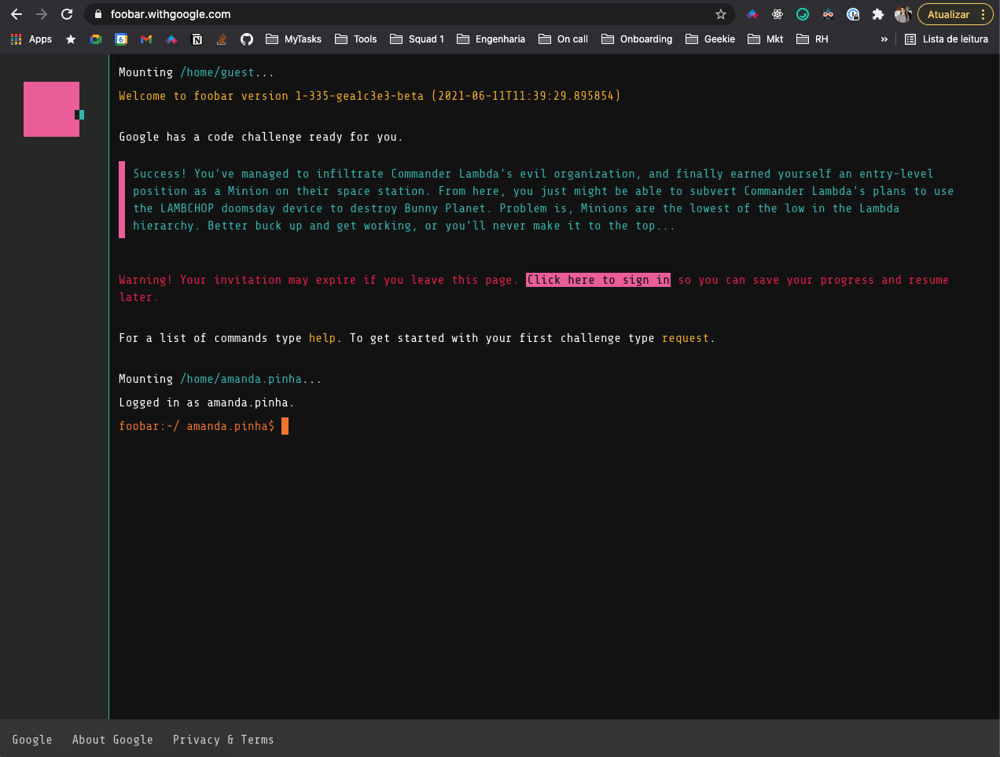

# google-foobar

My solutions for Google's foobar challenge.



## Journal

```text
Success! You've managed to infiltrate Commander Lambda's evil organization, and finally earned
yourself an entry-level position as a Minion on their space station. From here, you just might be
able to subvert Commander Lambda's plans to use the LAMBCHOP doomsday device to destroy Bunny
Planet. Problem is, Minions are the lowest of the low in the Lambda hierarchy. Better buck up and
get working, or you'll never make it to the top...

Why did you sign up for infiltration duty again? The pamphlets from Bunny HQ promised exotic and
interesting missions, yet here you are drudging in the lowest level of Commander Lambda's
organization. Hopefully you get that promotion soon...

You survived a week in Commander Lambda's organization, and you even managed to get yourself
promoted. Hooray! Henchmen still don't have the kind of security access you'll need to take down
Commander Lambda, though, so you'd better keep working. Chop chop!

The latest gossip in the henchman breakroom is that "LAMBCHOP" stands for "Lambda's Anti-Matter
Biofuel Collision Hadron Oxidating Potentiator". You're pretty sure it runs on diesel, not biofuel,
but you can at least give the commander credit for trying.

The perks are definitely better as a Henchman than as a Minion. You're even allowed to sleep lying
down!
```
